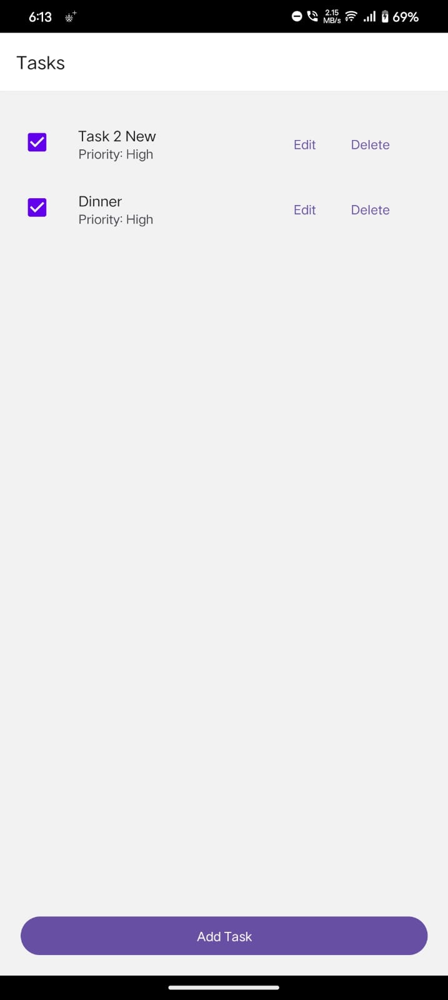
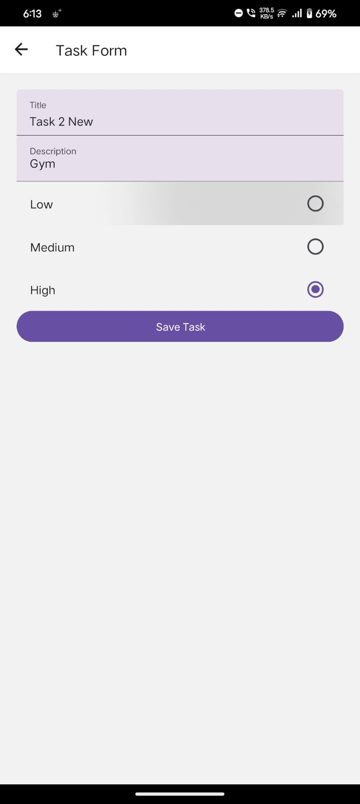

# Task Management App

A simple Task Management App built with React Native CLI that allows users to add, edit, delete, and mark tasks as completed. The app uses Redux Toolkit for state management and React Navigation for navigation. Completed tasks are automatically removed from the list.

## Features

- **Add Task:** Create a new task with a title, description, and priority (Low, Medium, High).
- **View Tasks:** Display tasks in a scrollable list. Only tasks that are not completed are visible.
- **Edit Task:** Modify an existing task's details.
- **Delete Task:** Remove a task from the list.
- **Mark as Completed:** Toggle a task's completion status. Completed tasks are automatically filtered out.
- **Native UI Components:** Uses `@react-native-community/checkbox`   & `@react-native-paper` for ui experience.

## Setup
- **Install Node JS**
- **Clone the repo** ``git clone https://github.com/thakkarnetram/harmoni-task``
- **Open in any editor** 
- **Install the dependencies** `npm i`
- **Run a virtual device or connect physical device**
- **Run the metro server** `npx react-native start`
- **Spilt a second terminal and run** `npm run android`

## Screenshots

  
  

## Video
<video width="640" height="360" controls>
  <source ur src="./src/sample/sample.mp4" type="video/mp4">
  Your browser does not support the video tag.
</video>
